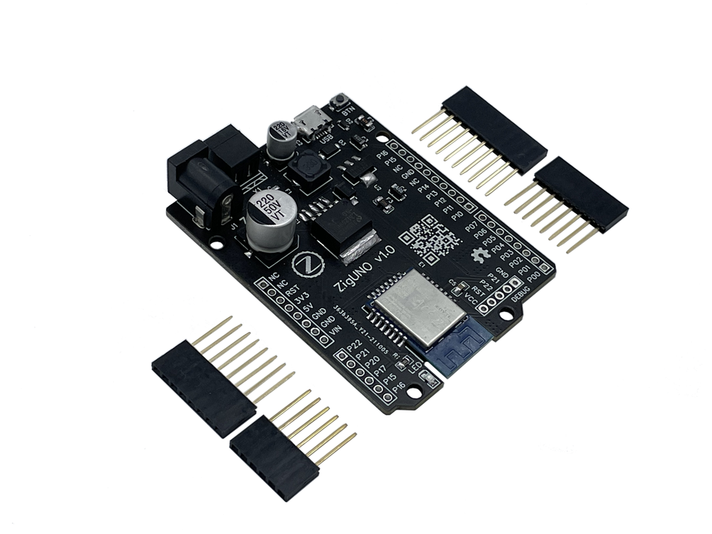
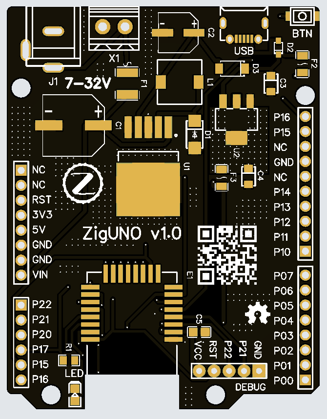
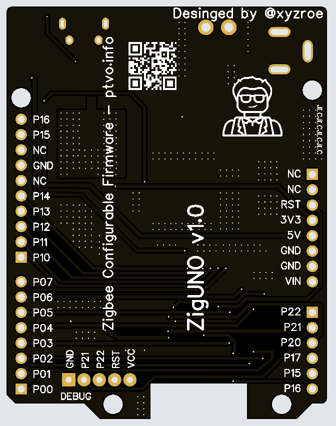
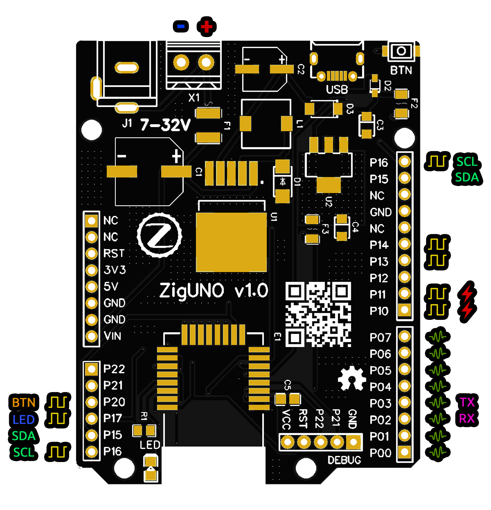
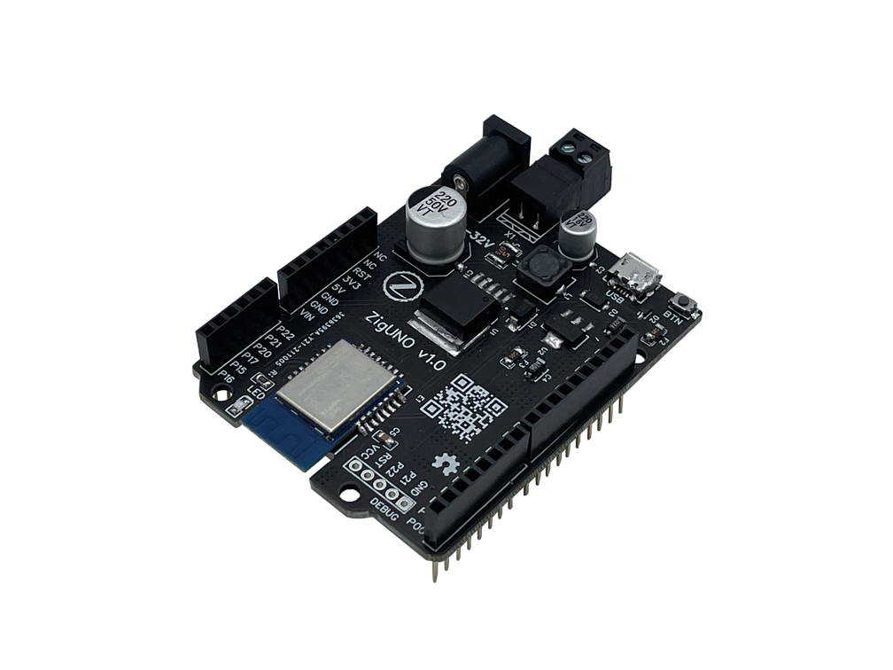
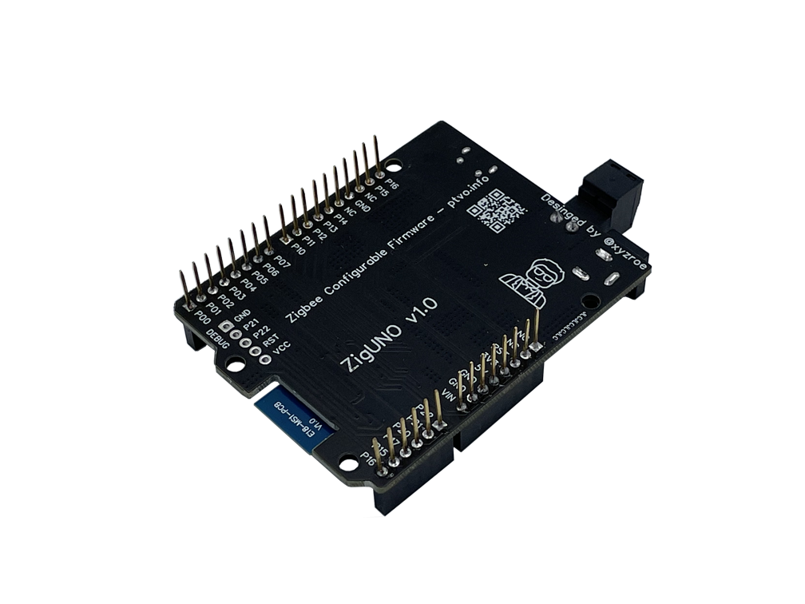
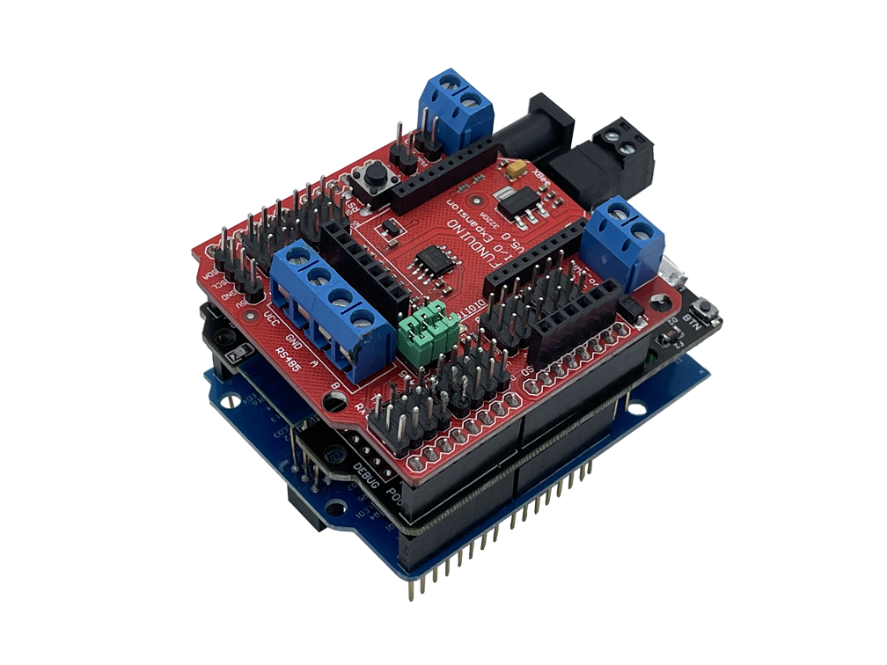
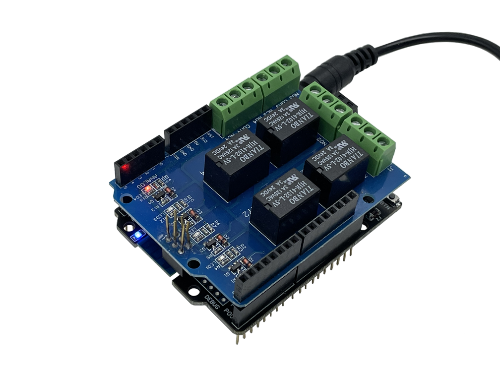
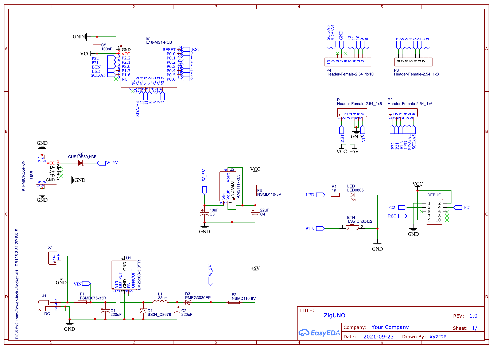

# ZigUNO

ZigUNO is a development board for creating DIY Zigbee devices based on Ebyte E18-MS1 module (CC2530)

Physically, the board is compatible with all shields of the Uno form factor. Finally you can use countless old Arduino shields 🤣

As a firmware, it is proposed to use:
1. Zigbee configurable firmware [PTVO](https://ptvo.info)
2. Develop custom one using [DIYRuZ](https://diyruz.github.io/) projects as examples

### Overview

<table>
<tr>
<td width="50%">

##### Top

</td>
<td>

##### Bottom

</td>
</tr>
</table>

### Pinout

### Photos
<table>
<tr>
<td width="50%">

</td>
<td>

</td>
</tr>
<tr>
<td width="50%">

</td>
<td>

</td>
</tr>
</table>

### Schematic

### Gerber & BOM
[Gerber](./2530_v1/files/Gerber_ZigUNO.zip)  
[BOM](./2530_v1/files/BOM_ZigUNO.csv)

   
ZigUNO is licensed under the

[GNU General Public License v3.0](https://github.com/xyzroe/ZigUNO/blob/main/LICENSE)
