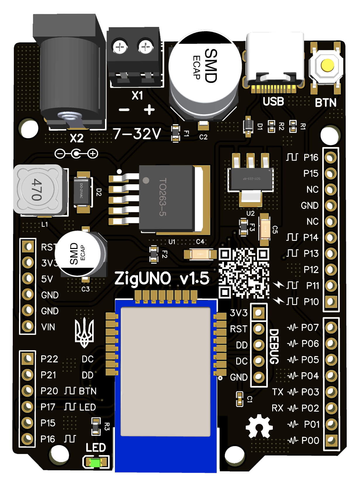

# ZigUNO

ZigUNO is a development board for creating DIY Zigbee devices based on Ebyte E18-MS1 module (CC2530)

Physically, the board is compatible with all shields of the Uno form factor. Finally you can use countless old Arduino shields 🤣

As a firmware, it is proposed to use:
1. Zigbee configurable firmware [PTVO](https://ptvo.info) 🚀
2. Develop custom one using [DIYRuZ](https://diyruz.github.io/) projects as examples

### Overview

#### v1.5 (Jun 2022)
<table>
<tr>
<td width="50%">

</td>
<td>

</td>
</tr>
</table>

**Version 1.5 differences:**
- Type C instead of micro usb, keeping up with the times 🤩
- The 8-pin connector has been replaced with a 6-pin connector. the last two are not connected and only interfere with some sub-boards 🤦‍♂️
- Rearranged components on the board 🙃
- Added designations of pin capabilities directly to the board to make it even more convenient for you 🥳
- Slightly changed the graphics on the board, as a sign of support for Ukraine 🇺🇦

*Scheme is the same. Gerber files will be uploaded after the tests. Photo too.*

#### v1.0
<table>
<tr>
<td width="50%">

</td>
<td>

</td>
</tr>
</table>

### Pinout

### Photos
<table>
<tr>
<td width="50%">

</td>
<td>

</td>
</tr>
<tr>
<td width="50%">

</td>
<td>

</td>
</tr>
</table>

### Schematic

### Gerber & BOM
[Gerber](./2530_v1/files/Gerber_ZigUNO.zip)  
[BOM](./2530_v1/files/BOM_ZigUNO.csv)

### Where to buy?
<table>
<tr>
<td width="50%">

</td>
<td>

</td>
</tr>
</table>

### Like ♥️?

   
ZigUNO is licensed under the

[GNU General Public License v3.0](https://github.com/xyzroe/ZigUNO/blob/main/LICENSE)
